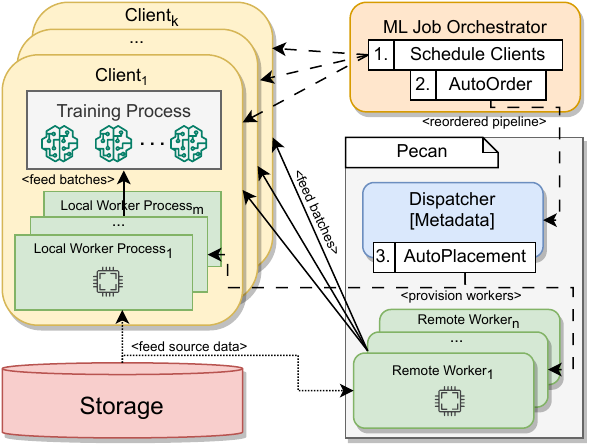

<p align="center">
  
</p>

# Pecan: Cost-Efficient ML Data Preprocessing with Automatic Transformation Ordering and Hybrid Placement

Pecan is a multi-tenant service for cost-efficient input data processing in machine learning jobs. 

To minimize end-to-end ML training cost, Pecan utilizes two policies: 
1) Pecan’s AutoPlacement policy scales data preprocessing workers and places them across local and remote resources to minimize cost.
2) Pecan's AutoOrder policy transparently reorders input pipeline transformations to maximize per-worker throughput.

Pecan builds on top of the [Cachew](https://www.usenix.org/system/files/atc22-graur.pdf) data loading framework in [TensorFlow](https://github.com/tensorflow/tensorflow), extending [tf.data service](https://www.tensorflow.org/api_docs/python/tf/data/experimental/service) with the AutoPlacement and AutoOrder policies. 

**This repository is a fork of TensorFlow with the source code for Pecan.**


## Pecan System Architecture

Pecan consists of a centralized dispatcher and a dynamic number of remote and local input data workers.

<p align="center">
  
</p>

Users register training nodes (i.e., clients) with the Pecan dispatcher. To execute an input pipeline with Pecan, clients provide a graph representation of the input pipeline and a path to the input dataset in a cloud storage bucket. Pecan supports and extends the tf.data API for defining input data pipelines from a collection of composable and user-parametrizable operators. To ensure preprocessing semantics are maintained in the context of the AutoOrder policy, users may annotate their tf.data input pipeline to mark transformations with strict dependencies using the `keep_posistion=True` flag. Otherwise Pecan can can perform any reordering in compliance with the AutoOrder policy as described in Section 5.2 of the paper.

Pecan's input data workers are stateless components responsible for producing batches of preprocessed data for clients. The dispatcher dynamically adjusts the number of input data workers for each job to minimize epoch time while keeping costs low. Pecan also profiles and maintains metadata about the inflation factors of the transformations in the input pipeline to make reordering decisions.

Clients fetch data from the workers that are assigned to them by the dispatcher. Clients and workers periodically send heartbeats to the dispatcher to maintain membership in the service and provide metrics used for the worker scaling policies.

## Deploying and Using Pecan

The [pecan-experiments](https://github.com/eth-easl/pecan-experiments) repository provides scripts and instructions to get started with a Pecan deployment and execute example ML input data pipelines. The repository also provides detailed instructions for reproducing the key results from the Pecan research paper published at USENIX ATC'24. 

## Contributing

We welcome contributions and PRs to Pecan.
 
## Referencing our work

Pecan will appear at USENIX ATC'24. If you decide to use Pecan in your work, please cite our paper: 

```
@inproceedings{pecan,
  author    = {Dan Graur and
               Oto Mraz and
               Muyu Li and
               Sepehr Pourghannad and
               Chandramohan A. Thekkath and
               Ana Klimovic},
  title     = {Pecan: Cost-Efficient ML Data Preprocessing with Automatic Transformation Ordering and Hybrid Placement},
  booktitle = {Proceedings of the USENIX Annual Technical Confernece (ATC'24)},
  publisher = {{USENIX}},
  year      = {2024},
}
```

